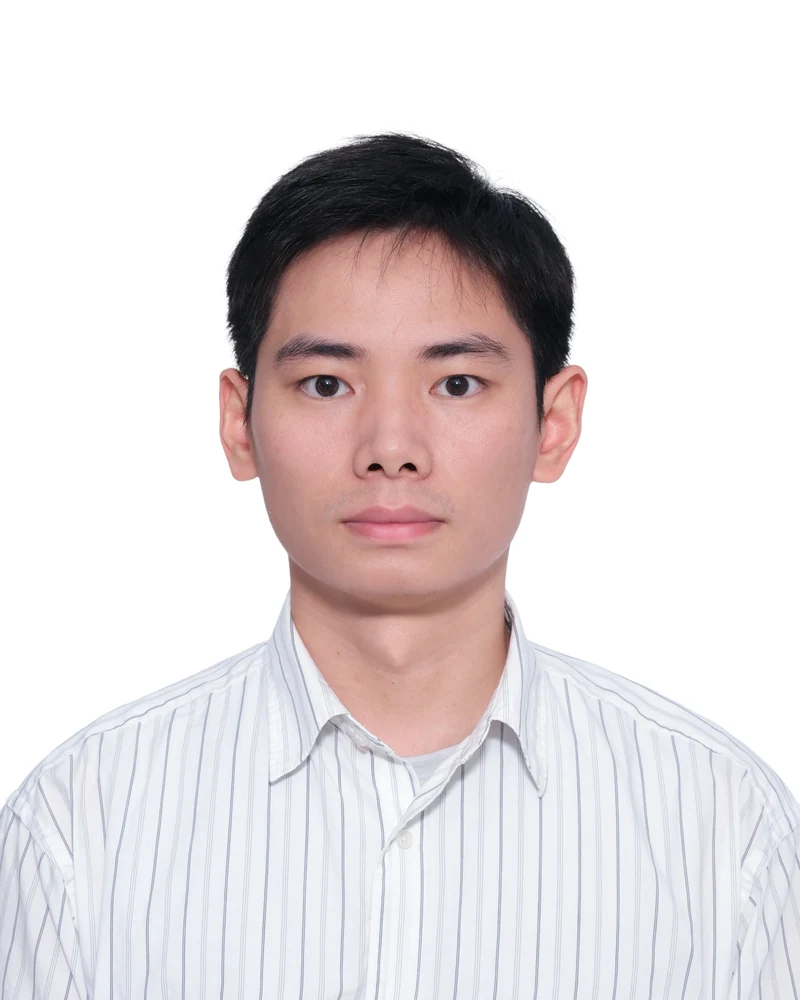
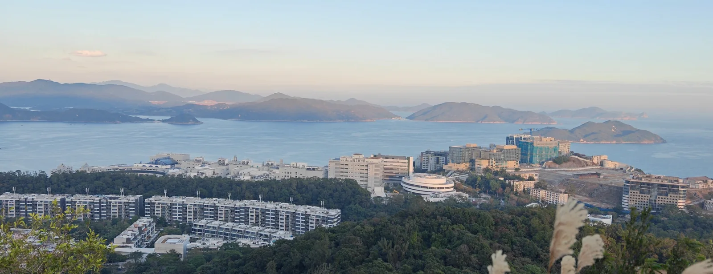
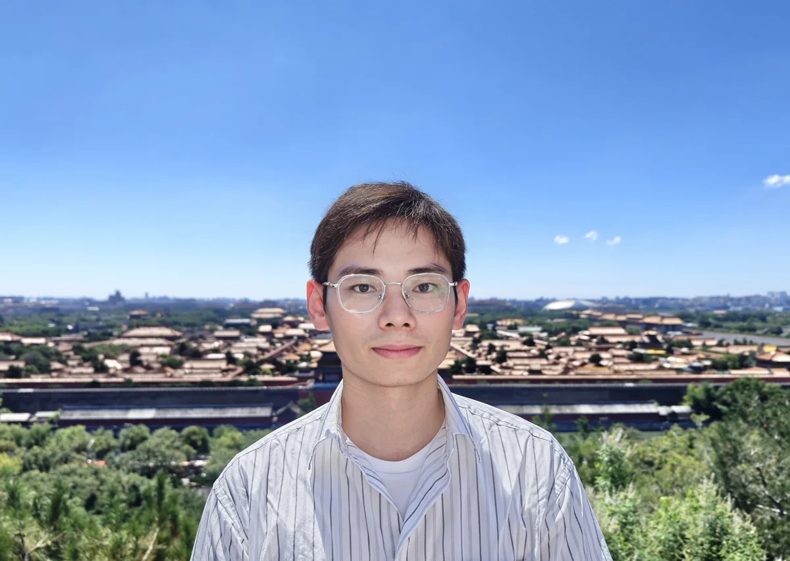

```{=html}
<main id="main-content" class="page-shell home-shell" tabindex="-1">
<section class="academic-intro" aria-labelledby="profile-name">
  
  <div class="profile-copy">
    <h1 id="profile-name">HUANG Yuntong</h1>
    <p class="profile-role">PhD Candidate in Mathematics · HKUST</p>
    <p>I develop mathematical and computational models for microstructure evolution. My research connects <strong>phase-field modeling</strong>, <strong>computational mechanics</strong>, and <strong>scientific machine learning</strong>.</p>
```



```{=html}
    <div class="profile-actions" aria-label="Contact and curriculum vitae">
      <a href="mailto:yt.huang@connect.ust.hk">Email</a>
      <a href="cv/">CV</a>
      <a href="https://github.com/Hatomzre">GitHub</a>
    </div>
  </div>
</section>

<section class="research-overview academic-section" aria-labelledby="interests-heading">
  <h2 id="interests-heading">Research interests</h2>
  <div>
    <ul class="research-focus">
      <li>Phase-field modeling of microstructure evolution and interfaces</li>
      <li>Physics-based neural modeling for materials science</li>
      <li>Graph neural networks for polycrystalline materials</li>
    </ul>
    <a class="text-link" href="research/">Research overview</a>
  </div>
</section>

<section class="academic-section" aria-labelledby="selected-publications-heading">
  <div class="section-heading-row">
    <h2 id="selected-publications-heading">Selected publications</h2>
    <a class="text-link" href="publications/">All publications</a>
  </div>
```



```{=html}
</section>

<section class="academic-section background-grid" aria-label="Academic background">
  <div>
    <h2>Education</h2>
    <div class="compact-history">
      <article><span>2023–present</span><div><h3>PhD in Mathematics</h3><p>Hong Kong University of Science and Technology</p></div></article>
      <article><span>2020–2023</span><div><h3>MSc in Computational Mathematics</h3><p>Wuhan University</p></div></article>
      <article><span>2016–2020</span><div><h3>BSc in Materials Science and Engineering</h3><p>Central South University</p></div></article>
    </div>
  </div>
  <div>
    <h2>Recognition &amp; service</h2>
    <ul class="recognition-list">
      <li><strong>RedBird Academic Excellence Award</strong><span>HKUST · 2025</span></li>
      <li><strong>Hong Kong PhD Fellowship</strong><span>Hong Kong Research Grants Council · 2023</span></li>
      <li><strong>Organizer, EASIAM 2026 Special Student Session</strong><span>2026</span></li>
    </ul>
    <a class="text-link" href="teaching/">Teaching &amp; service</a>
  </div>
</section>

<section class="academic-section personal-section" aria-labelledby="personal-heading">
  <div class="section-heading-row"><h2 id="personal-heading">Beyond research</h2><p>A few moments from life in Hong Kong and travels.</p></div>
  <div class="personal-photos">
    <figure><figcaption>HKUST, Clear Water Bay</figcaption></figure>
    <figure><figcaption>Away from the desk</figcaption></figure>
  </div>
</section>
</main>
```
